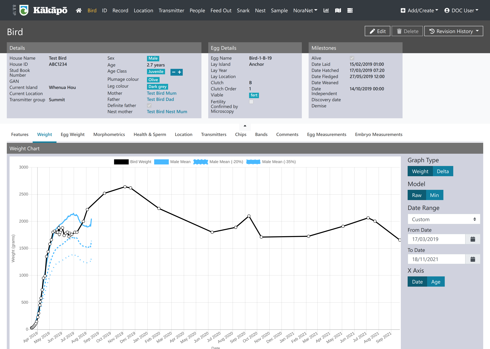

## Background

The national Kākāpō Database (Dusky) was developed in 2018 to replace an Access database solution that had reached the end of its life. Being a critically endangered parrot, kākāpō are confined to pest-free offshore islands which may not have a reliable internet connection. Thus, the challenge of Dusky was enabling offline use, whilst still maintaining consistency of data across the different islands.

To do this, a solution employing Couchbase and Couchbase Sync Gateway was implemented. A copy of Dusky is run in "the cloud", and various laptops have the database loaded locally. The laptops are able to be used offline, and when they are connected to the internet Dusky will synchronise any changes made (bi-directionally).

In addition to Couchbase and Couchbase Sync Gateway, Dusky uses the Angular and Spring Boot frameworks for the front-end and back-end respectively.

## Features

The data captured by Dusky is quite specific to the needs of kākāpō conservation. In this instance, every single kākāpō is known and tracked which means there is a large amount of information is known about a relatively small number of individuals—compared to other bird data projects, where a little bit of information is known about a relatively large population.

As such, the database is built to capture lots of different types of information including:

- Bird details (morphometrics, weight, health, transmitters, microchips/identifiers)
- Egg/chick weights, egg fertility/infertility, embryo development
- Transmitter changes and types (different birds wear different types of transmitters depending on sex/time of year)
- Supplementary feeding
- "Snark" stations capture automatic information about bird whereabouts based on transmitters (e.g. if a bird accessed a certain food hopper)
- Nest information
- Population demographics
- Biological samples and laboratory results
- "NoraNet", a network of devices that recieve information from the transmitters carried by the birds
- Geospatial information

Direct data exports from the database are provided to the kākāpō team on an hourly basis, enabling them to build automatically-updating reporting tools with the latest datasets.

:::note Fun Fact
The (in)famous [Party Parrot](https://cultofthepartyparrot.com/) is based on the kākāpō Sirocco—New Zealand's official Spokesbird for Conservation. 

:::

## Code
* <https://github.com/docgovtnz/dusky>: Monorepo with front-end and back-end

## About the code

The source code is provided as-is, with certain sections redacted/removed for security reasons. 

The normal process for a DOC developer would involve setting up their local machine to synchronise with a remote gateway containing the data—being a NoSQL type architecture, there are assumptions built into the code about certain data structures being present. However, due to the sensitive nature of some of the kākāpō data it is not possible to provide a copy of this dataset.