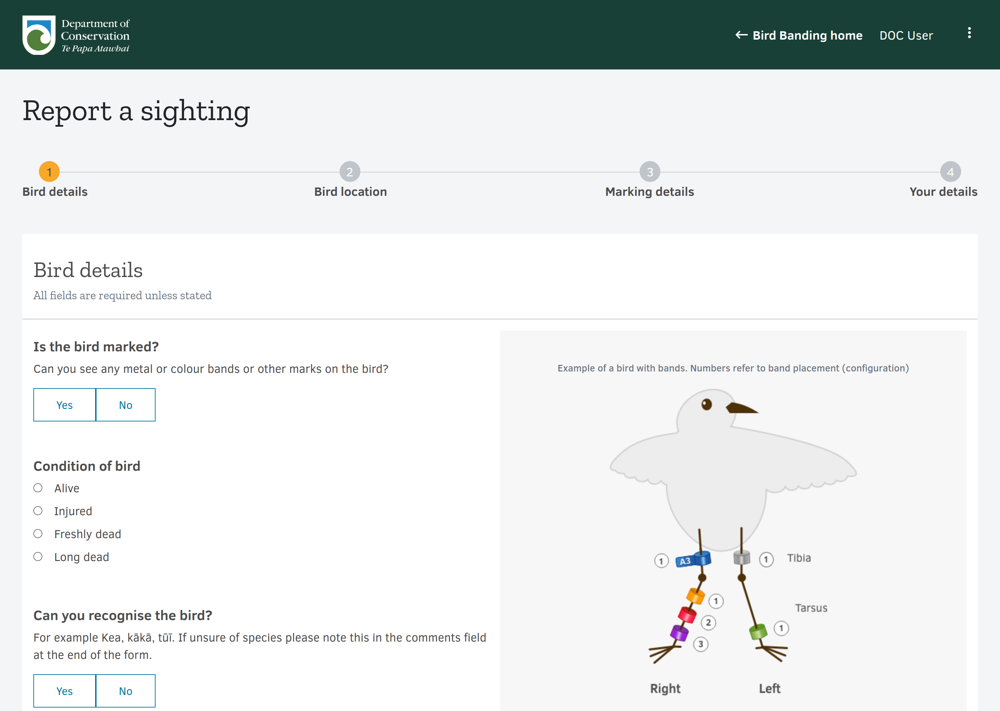

## Background

The National Banding Office needed a system for managing the various datasets they are required to maintain, including what birds carry what bands, band stock management and tracking the status of people involved in bird banding—both within the Department and in external community groups. Bands and banding practices can come in many different forms, and the system needed to be flexible enough to track all of the relevant information, whilst maintaining a level of data consistency.

Since the Department and its predecessors have been issuing bands, there have been over two million bands issued—meaning the system needed to be capable of handling some quite significant volumes of information.

The application is broken into three major components:
* **Prerequisite infrastructure**: AWS CloudFormation configuration for configuring supporting services (including authentication, alerting and static web hosting)
* **Data service**: Serverless-based back-end
* **Client application**: Angular-based Single Page Application (SPA)

These components are described in more detail further down the page.

## Features

* Record management (first marking, re-marking, recovery) on a per-project basis
* Flexible schema allowing the recording of different marking configurations and other relevant fields about a bird capture
* Automated bulk import and validation processes from a structured spreadsheet
* Advanced searching by multiple criteria and bulk data exports (exceeding 1.5 M rows of data)
* Stock management, including transfers between people and the banding office
* Public-facing form for observations of banded birds
* Migration of decades of historical band records

## Code

* <https://github.com/docgovtnz/birdbanding-infra>: Supporting infrastructure configuration
* <https://github.com/docgovtnz/birdbanding-services>: Serverless-based back-end
* <https://github.com/docgovtnz/birdbanding-client>: Angular-based front-end

## About the code

The source code is provided as-is, with certain sections redacted/removed for security reasons.

The nature of a serverless-style project is that cloud configuration is deeply intertwined with the back-end source code and highly-specific to one cloud provider, but it may be possible to abstract certain elements for use elsewhere.

## Code/repository structure

*Further details coming soon.*